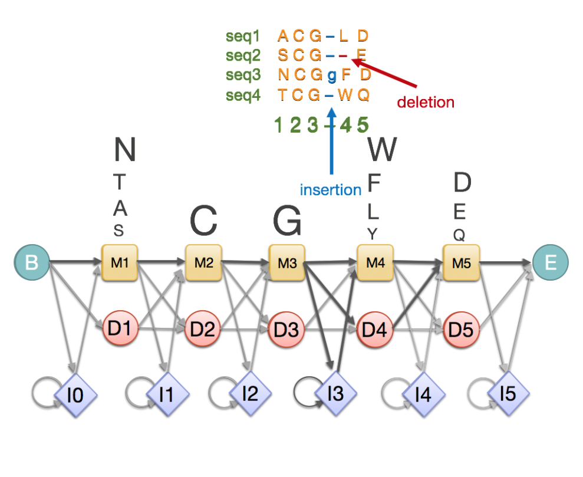
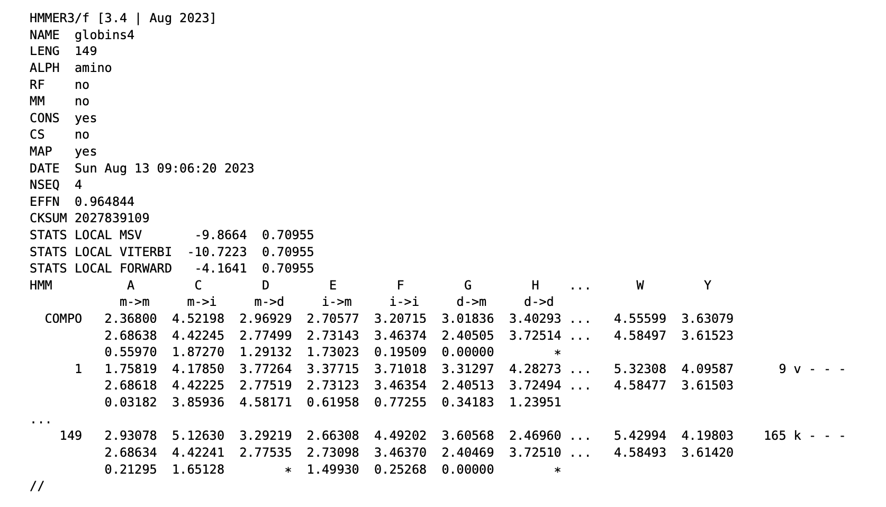
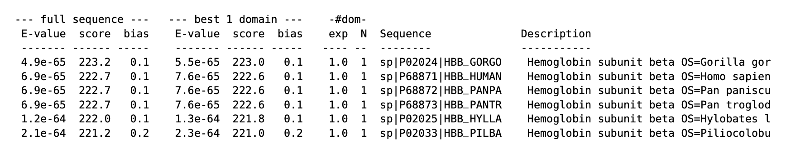
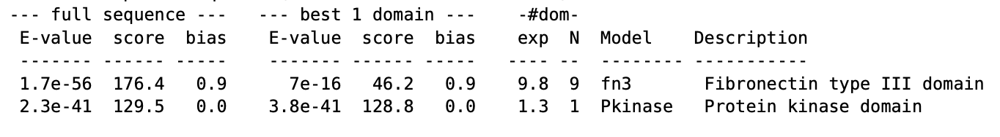

## Profile Hidden Markov Model (profile HMM)

Before diving into the HMMER suite, it's necessary to understand the underlying data structure it uses: the **profile Hidden Markov Model** (profile HMM). It is a generative model built from the Multiple Sequence Alignment (MSA) of the family. To measure how well a query sequence fits the family, we can use the probability of the profile HMM generating the sequence.
 
### Structure of Profile HMM

Let's look at the structure through an example profile HMM. The main body is the automaton, built from the multiple sequence alignment above it. (note: the family contains more sequences than the four shown). It consists of nodes called states and arrows denoting unidirectional transitions between states.

<figure>
  
  <figcaption>Figure 1. Example Profile HMM structure. Image source: European Bioinformatics Institute (EMBL-EBI), Pfam Training Course.</figcaption>
</figure>


#### States
The profile HMM is centered around the linear set of **match (M) states**, in between the beginning (B) state and the end (E) state. Each match state corresponds to a ***conserved*** MSA column, where most sequences contain a valid residue at that position, in contrast to a ***gappy*** column. Upon visiting the state, it will emit one residue from the set of characters (20 amino acids for proteins and nucleotides for DNA/RNA sequences). The **emission probability** is calculated from the residue frequency distribution within the MSA column it represents.

Additional states are used to account for gaps in the MSA. Each **deletion (D) state** is connected across a match state, and allows skipping the bounded match state and emits a "-" instead of a valid residue. It accounts for gaps ***within*** conserved MSA columns, as illustrated by the red arrow in the diagram. **Insertion (I) state** accounts for gaps of variable length, and represents the extra residues ***between*** conserved MSA columns (indicated by the blue arrow).

#### Transition and Other Parameters
To move between states, we also need **transition probabilities**, the probabilities of moving from current states to the neighboring states downstream. For example, if we are at `M3`, we will have probabilities

>P1 = P(<code>M3</code> &rarr; <code>M4</code>)<br>P2 = P(<code>M3</code> &rarr; <code>D4</code>)<br>P3 = P(<code>M3</code> &rarr; <code>I3</code>)


The full set of parameters used in profile HMM is listed below:
<div style="border:1px solid #ccc; padding:8px; display:inline-block; margin:12px 0; background:#fdfdfd;">
  <ul style="margin:0; padding-left:16px; line-height:1.4;">
    <li>&Sigma;: the set of symbols</li>
    <li>Q: the set of states</li>
    <li>e<sub>j</sub>(S): the probability of emitting residue S while in state j</li>
    <li>T: the matrix of transition probabilities
      <ul style="margin:4px 0 0 16px; padding-left:14px;">
        <li>T[j,k]: probability of moving from state j to state k</li>
      </ul>
    </li>
    <li>&pi;: the probability distribution on the initial state</li>
  </ul>
</div>


### Path and Probability
Consider an example string `S` = `"TCLD"`. Our profile HMM `M` can generate this sequence by following multiple paths. One possible path is:
> `PATH` = `B` -> `M1` → `M2` → `D3` → `M4` → `M5` -> `E`

The probability of generating this sequence by following the path is the product of emission probabilities of each match state emitting the corresponding residue:
> **P**(<code>S</code> | <code>PATH</code>, <code>M</code>) = e<sub>M1</sub>(T) * e<sub>M2</sub>(C) * e<sub>M4</sub>(D) * e<sub>M5</sub>(D)
 
The probability of traversing through this path in our profile HMM is the product of transition probabilities:
> **P**(<code>PATH</code> | <code>M</code>) = &pi;[<code>M1</code>] * T[<code>M1</code>, <code>M2</code>] * T[<code>M2</code>, <code>D3</code>] * T[<code>D3</code>, <code>M4</code>] * T[<code>M4</code>, <code>M5</code>]

And the overall probability of the model generating the sequence `S` through this path is:
> **P**(<code>S</code> | <code>PATH</code>, <code>M</code>) = **P**(<code>S</code> | <code>PATH</code>, <code>M</code>) * **P**(<code>PATH</code> | <code>M</code>)

Among all possible paths that can generate the sequence `S`, we can either sum over the probabilities of all possible paths, or find the max probability (Viterbi path) among them. Both algorithms are supported in HMMER, and this final probability is used to evaluate how well the sequence fits the profile HMM.


## HMMER Workflow

The effective use of HMMER relies on understanding its workflow. Unlike simple pairwise alignment tools that function as a single step (sequence A vs. sequence B), HMMER operates as a multi-stage pipeline. This pipeline transforms raw biological data into a statistical model, which is then utilized to either discover new homologs in sequence databases or to annotate functional domains by querying profile databases.

This section lists out HMMER workflow that follows a linear progression consisting of **four distinct stages**:

### 1. Input

To get started, we need to input a high-quality **Multiple Sequence Alignment (MSA)**. HMMER cannot build a profile from a single sequence; it requires the evolutionary context provided by a family of aligned sequences to determine which residues are conserved and which are variable.
        

### 2. Profile Construction

This stage uses `hmmbuild` command to convert the biological alignment into a mathematical Profile HMM. It implements the theoretical concepts of **Match, Insert, and Delete** states to model the evolutionary constraints of the family.

### 3. Application: The Search Strategies

Once the profile is built, the workflow can go into two directions based on the research objective:

- **Homology Search (`hmmsearch`)**: Used for discovery. It takes the custom profile HMM and scans a target sequence database to find new homologs.
        
- **Domain Annotation (`hmmscan`):** Used for identification. It takes a single query sequence and scans it against a library of profiles HMM to identify functional domains within the sequence.

### 4. Output: Ranked Results

Both strategies generate a list of matches. HMMER filters biological signals from random noise, presenting hits ranked by bit score and e-value.
           
## HMMER Functions

While the workflow provides the roadmap, understanding the specific mechanics of each tool is essential for effective analysis. This section details the primary functions used in HMMER analysis: `hmmbuild`, `hmmsearch` and `hmmscan`.

### `hmmbuild`: Profile Construction

`hmmbuild` creates a profile from an alignment. It is responsible for transforming the evolutionary information contained in a multiple sequence alignment into a binary-compatible statistical model.

**Input** The input for this command is a Multiple Sequence Alignment (MSA). The software is designed to accept several standard bioinformatics alignment formats, including Stockholm (`.sto`), Clustal (`.aln`), or aligned FASTA.

**Process** The tool reads the alignment column-by-column and applies the Profile HMM statistical architecture (calculating Match, Insert, and Delete state probabilities) as explained in the previous section. It converts the observed biological data into a probabilistic model without requiring manual parameterization.

**Output** The command generates a Profile HMM file (ending with `.hmm` extension). This serves as a binary-compatible file that contains all information needed for later search strategies.

**Usage** The command requires the user to specify an output filename followed by the input alignment. For example, if you want to create a new profile HMM named `hemoglobin.hmm` from the source alignment `hemoglobin.sto`, you can use the command
```
# Syntax: hmmbuild [output_hmm_file] [input_msa_file]
hmmbuild hemoglobin.hmm hemoglobin.sto
```

Below is an example of output HMM file. It begins with a header section containing metadata such as the family name, length, and type (amino acid or nucleotide). This is followed by the main model section, which contains a matrix of position-specific log-odds scores for match, insert, and delete states.



### `hmmsearch`: Homology Search

Once a profile has been constructed using `hmmbuild`, the most common tool to use is **`hmmsearch`**. It is designed to find homologs in a large sequence database using your profile HMM, providing a highly sensitive method for detecting homologs that traditional tools might miss.

**Input** `hmmsearch` requires two inputs. 
1. Query: the **Profile HMM** file generated by `hmmbuild`. 
2. Target: a **sequence database**. It can be a standard FASTA file containing protein sequences, such as a whole genome or a comprehensive repository like UniProt.
   
**Process** The software performs a "Profile v.s. Sequence" search. It compares the statistical pattern of the profile against every sequence in the target database to detect **remote homologs**, which are sequences that have diverged significantly in primary structure but retain the essential structural or functional constraints of the family.

**Output** The software produces a ranked list of hits as output. These hits are sorted based on e-value and bit score, which measures the statistical significance and raw quality of the match. The output also includes the specific alignments showing where the model matched the target sequences.

**Usage** To execute a search, the user runs the command followed by the profile file and the target sequence database. For example, if you want to search the `uniprot.fasta` database using the `hemoglobin.hmm` profile and prints the results to the standard output, you can use the command
```
# Syntax: hmmsearch [query_hmm_file] [target_msa_file] > [output_file]
hmmsearch hemoglobin.hmm uniprot.fasta > hemoglobin.out
```
Below is an example of the output list. This list is ranked by the "E-value" column, with the most statistically significant matches appearing at the top. Beside this, the "score" column provides the bit score, which is a standardized metric derived from the alignment's raw score. The "sequence" column indicates the matched sequence identifier, and the "Description" column shows a brief description of the sequence. This structure allows users to quickly filter low-quality hits and focus on the most biologically relevant alignments.



### `hmmscan`: Domain Annotation

`hmmscan` is a tool used to search protein sequences against a database of profile HMMs. It can identifies known domains present within the query sequences, which makes it an essential software for domain annotation.

**Input** `hmmscan` requires two inputs.

1.  Query: a file containing one or more **protein sequences**, typically in FASTA format.
2. Target: a **Profile HMM Database** (e.g., Pfam). This database must be prepared using `hmmpress`, which compress and index your profile database for faster lookups.    

**Process** `hmmscan` performs a "Sequence v.s. Profile" search. It operates by reading the query sequence and scanning it against the entire indexed profile database. It annotates the query sequence by identifying which known domains or families within the database are present in the query.

**Output** The output is a ranked list of profile HMMs that match the query sequence with statistical significance, organized by E-value and bit score.

**Usage**
First, compress the profile database:
```
# Combine multiple HMM files into a single database file
cat fn3.hmm Pkinase.hmm > hmmdb

# Compress and index the database
hmmpress minifam
```
When the profile database is prepared, we can run `hmmscan` followed by the profile database and the query sequence file. 
```
# Syntax: hmmscan [target_hmm_database] [query_seq_file] > [output_file]
hmmscan hmmdb seq.fasta > results.out
```
Below is an example of the `hmmscan` output ranked list. Similar to `hmmsearch`, the results are sorted by E-value. The difference is that now each row represents a valid hit of matched profile model. The **Model** column identifies the profile name (e.g., "fn3", "Pkinase"), and the **Description** column provides a brief summary of that domain's function. This layout allows researchers to rapidly identify which functional domains are present within their query protein.



### Difference between `hmmsearch` and `hmmscan`

It's easy to confuse `hmmsearch` and `hmmscan` because they both use HMMs and sequences to find similarities, but they work in opposite directions depending on what you have as a query and what you are searching against.

Below is a comparison table between `hmmsearch` and `hmmscan`:
|  | hmmsearch | hmmscan | 
 | ----- | ----- | ----- | 
| **Input Query** | **Profile HMM** (e.g., a model of the hemoglobin family) | **Sequence** (e.g., a specific protein FASTA file) | 
| **Target Database** | **Sequence Database** (e.g., UniProt) | **Profile HMM Database** (e.g., Pfam) | 
| **Primary Goal** | To find new sequences that belong to the query profile family. | To annotate the query sequence with known domains.

## References
http://eddylab.org/software/hmmer/Userguide.pdf

"Example Profile HMM Structure." EMBL-EBI: Pfam — Creating Protein Families, European Bioinformatics Institute,  
https://www.ebi.ac.uk/training/online/courses/pfam-creating-protein-families/what-are-profile-hidden-markov-models-hmms/.
